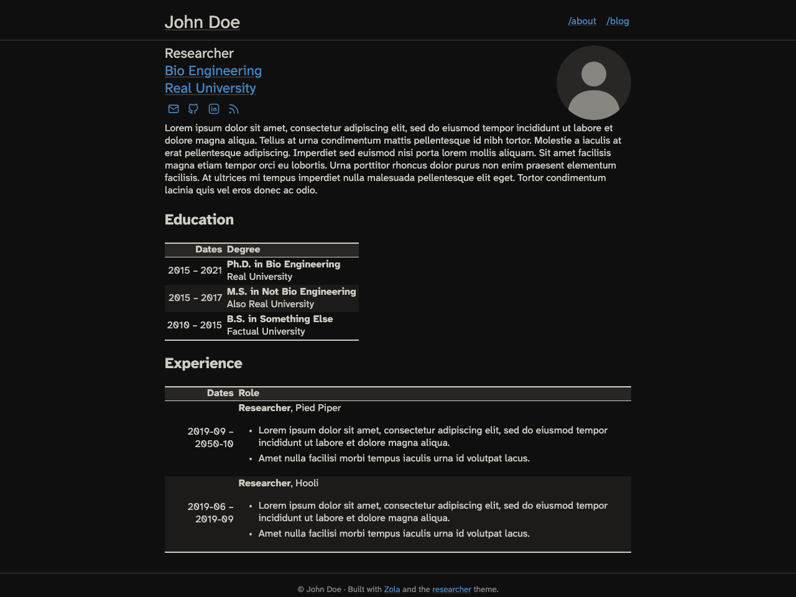

# Researcher

Researcher is a clean, responsive portfolio and blog theme for [Zola](https://www.getzola.org/), based on the [Jekyll theme of the same name](https://github.com/ankitsultana/researcher).
It uses a dark, [Flexoki](https://stephango.com/flexoki)-inspired palette and ships everything it needs: fonts, icons, math rendering, and feed styling all work offline with no CDN dependencies (unless you opt into them).

[Demo website](https://zola-researcher.pages.dev)



## Features

- Portfolio landing page plus a paginated blog with an Atom feed
- Bundled [Atkinson Hyperlegible Next](https://www.brailleinstitute.org/freefont/) variable font (SIL OFL 1.1)
- KaTeX math rendering, rendered client-side with locally hosted assets
- Shortcodes for figures, YouTube embeds, asides/admonitions, and wide tables
- Human-friendly XSLT-styled Atom feed
- [instant.page](https://instant.page/) prefetching (optional)
- Customizable fonts and extra CSS without forking the theme

## Installation

Download this theme to your `themes` directory:

```bash
cd themes
git clone https://github.com/lukehsiao/zola-researcher.git
```

and then enable it in your `config.toml`:

```toml
theme = "zola-researcher"
```

To preview the theme by itself, run `zola serve` from the theme's own directory: the repository doubles as the demo site.

## Content structure

The theme expects blog posts in `content/blog/`, with pagination enabled in `content/blog/_index.md`:

```toml
+++
paginate_by = 8
sort_by = "date"
title = "Blog"
description = "A collection of my blog posts."
insert_anchor_links = "right"

[extra]
keywords = "John Doe, blog, posts"
+++
```

The landing page is `content/_index.md`.
See this repository's `content/` directory for a complete working example.

Pages support a few optional knobs in their front matter:

```toml
+++
title = "My Post"
date = 2026-07-17
authors = ["Jane Smith"]  # defaults to config.extra.author

[extra]
keywords = "keywords, for, this, page"
toc = true       # render a table of contents
hidden = true    # exclude from listings and the feed
+++
```

## Options

All theme options live under `[extra]` in `config.toml`:

```toml
[extra]
# The name shown in the navbar, post bylines, and the footer.
author = "John Doe"

# Links to include in the navigation bar. An empty link points at the site
# root. Links are relative to the base_url, so something like "cv.pdf" works
# if that file exists in your site's static directory.
nav = [
  {name = "About", link = ""},
  {name = "CV", link = "cv.pdf"},
  {name = "Blog", link = "blog/"},
]

# Your Google Analytics ID. Analytics are omitted entirely when empty.
analytics = ""

# KaTeX math rendering; see below.
katex_enable = false

# instant.page prefetching; see below.
instantpage_enable = true

# Load Font Awesome from its CDN; see below.
fontawesome = false

# Extra stylesheets, relative to the site root, loaded after the theme's own
# CSS. Useful for overriding fonts or colors without forking the theme.
custom_css = []
```

A full example configuration is included in this repository's `config.toml`.

### Fonts

The theme bundles the [Atkinson Hyperlegible Next](https://www.brailleinstitute.org/freefont/) variable font for body text (licensed under the [SIL OFL 1.1](static/fonts/OFL.txt)) and uses a system monospace stack for code.
Both stacks are exposed as CSS custom properties, so you can swap them from your own stylesheet without touching the theme.

For example, create `sass/css/custom.scss` in your site:

```scss
@font-face {
  font-family: "My Fancy Mono";
  src: url("../fonts/MyFancyMono.woff2") format("woff2");
}

:root {
  --font-mono: "My Fancy Mono", monospace;
  // --font-body is also available.
}
```

and load it via `custom_css = ["css/custom.css"]` in `[extra]`.

### Favicon

The theme ships a generic `favicon.ico` and `favicon.svg`.
Replace them by putting your own files at the same paths in your site's `static` directory.

### KaTeX math formulas

Math support uses [KaTeX](https://katex.org/), enabled by setting `katex_enable = true` in `[extra]`.
All KaTeX assets are served locally.

With the extension enabled, use the `katex` shortcode:

```jinja
\KaTeX
```

`block=true` typesets a display block like `$$...$$` in LaTeX; omit it for inline math.

### Figure shortcode

Captioned figures, with optional link, background color, and border:

```jinja

Your caption here. Markdown works.

```

### Aside shortcode

Admonition blocks in four flavors: `note`, `tip`, `caution`, and `danger`.
The title is optional and defaults to the capitalized type.

```jinja

Some helpful advice. Markdown works.

```

### YouTube shortcode

A responsive, captioned YouTube embed:

```jinja

With some caption.

```

### Icons

For social or navigation icons, the theme recommends inline SVGs (the demo uses [Tabler Icons](https://tabler.io/icons)); they render offline and pull in only what you use.
If you prefer Font Awesome classes, set `fontawesome = true` to load it from its CDN.

### Customizing templates

Site templates override theme templates of the same name, and every block in `index.html` (`footer`, `favicon`, `extra_head`, ...) can be overridden individually.
For example, to replace the footer, create `templates/index.html` in your site:

```jinja



<p>My custom footer.</p>

```

## License

The theme is licensed under the [Blue Oak Model License 1.0.0](LICENSE.md).
The bundled Atkinson Hyperlegible Next font is licensed under the [SIL Open Font License 1.1](static/fonts/OFL.txt).
